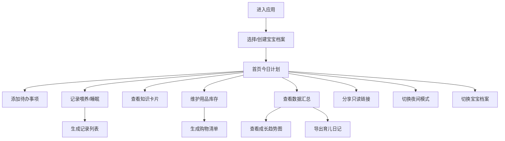

## 1. 产品概述

宝妈轻量纯前端育儿管理网页，专为新手妈妈设计，帮助高效整理每日育儿安排，记录宝宝成长点滴。

- **核心价值**：一站式育儿助手，降低新手妈妈的认知负担和管理成本
- **目标用户**：0-3岁宝宝的新手妈妈
- **技术特点**：纯前端实现，数据本地存储，无需注册登录即可使用

## 2. 核心功能

### 2.1 功能模块
1. **今日计划**：每日待办事项管理，支持添加、勾选、删除
2. **喂养记录**：记录喂奶、辅食、换尿布，含时间和备注
3. **睡眠记录**：记录睡眠时段，统计每日睡眠时长
4. **用品清单**：维护奶粉、纸尿裤等库存，生成购物清单
5. **知识卡片**：按月龄浏览护理提示，支持收藏
6. **家庭共享**：生成只读链接分享给家人
7. **数据汇总**：身高体重记录、趋势图、日记导出

### 2.2 页面详情

| 模块名称 | 子功能 | 功能描述 |
|---------|--------|----------|
| 今日计划 | 待办管理 | 添加待办、勾选完成、删除、按日期查看 |
| 喂养记录 | 喂奶记录 | 记录喂奶时间、奶量、备注 |
| 喂养记录 | 辅食记录 | 记录辅食种类、时间、备注 |
| 喂养记录 | 换尿布记录 | 记录换尿布时间、便便情况、备注 |
| 睡眠记录 | 睡眠时段 | 记录入睡/起床时间，自动计算时长 |
| 睡眠记录 | 睡眠统计 | 当日睡眠段数、总时长统计 |
| 用品清单 | 库存管理 | 奶粉/纸尿裤库存维护、低库存提醒 |
| 用品清单 | 购物清单 | 一键生成需购买物品清单 |
| 知识卡片 | 月龄提示 | 按月龄查看护理知识和发育提示 |
| 知识卡片 | 收藏管理 | 收藏/取消收藏卡片，收藏列表查看 |
| 家庭共享 | 分享链接 | 生成只读分享链接 |
| 数据汇总 | 成长记录 | 记录身高体重头围 |
| 数据汇总 | 趋势图表 | 身高体重增长趋势图 |
| 数据汇总 | 日记导出 | 导出当日/当月育儿日记 |
| 全局功能 | 多宝宝档案 | 切换多个宝宝档案 |
| 全局功能 | 夜间模式 | 日间/夜间主题切换 |
| 全局功能 | 疫苗提醒 | 设置疫苗和体检提醒 |

## 3. 核心流程

## 4. 用户界面设计

### 4.1 设计风格
- **主色调**：柔和粉色系（#FF9EB1），营造温馨亲切的育儿氛围
- **辅助色**：薄荷绿（#A8E6CF）、淡黄色（#FFEAA7）、淡蓝色（#74B9FF）
- **中性色**：米白、浅灰、深灰
- **按钮风格**：圆角胶囊按钮，柔和阴影，悬停微放大效果
- **字体**：展示字体用圆润可爱风格，正文字体清晰易读
- **布局风格**：卡片式布局，柔和圆角，轻阴影，温馨舒适
- **图标风格**：线性图标，柔和配色，与整体风格统一

### 4.2 页面设计概览

| 模块 | UI元素 | 设计要点 |
|------|--------|----------|
| 顶部导航 | 宝宝头像、名称、夜间模式切换、宝宝切换按钮 | 固定顶部，毛玻璃效果 |
| 今日计划 | 日期选择、待办列表、添加按钮 | 卡片式，复选框带动画 |
| 喂养记录 | 分类Tab（喂奶/辅食/尿布）、记录列表、添加弹窗 | 时间轴样式呈现 |
| 睡眠记录 | 睡眠时段卡片、统计数据、添加按钮 | 用月亮/太阳图标区分昼夜 |
| 用品清单 | 分类库存卡片、低库存标红、购物清单按钮 | 进度条显示库存余量 |
| 知识卡片 | 月龄选择器、卡片翻转动画、收藏按钮 | 左右滑动切换卡片 |
| 家庭共享 | 链接展示区、复制按钮、二维码占位 | 简洁明了 |
| 数据汇总 | 统计卡片、图表区、导出按钮 | 图表用渐变填充 |

### 4.3 响应式设计
- 桌面端：左侧导航 + 右侧内容区的双栏布局
- 平板端：顶部Tab导航 + 内容区
- 移动端：底部导航栏 + 全屏内容区
- 触控优化：按钮最小尺寸44x44px，卡片点击区域足够大

### 4.4 动效设计
- 页面切换：淡入淡出 + 轻微位移
- 卡片悬停：微微上浮 + 阴影加深
- 勾选待办：打勾动画 + 文字删除线过渡
- 添加记录：从底部滑入弹窗
- 夜间模式切换：平滑颜色过渡
