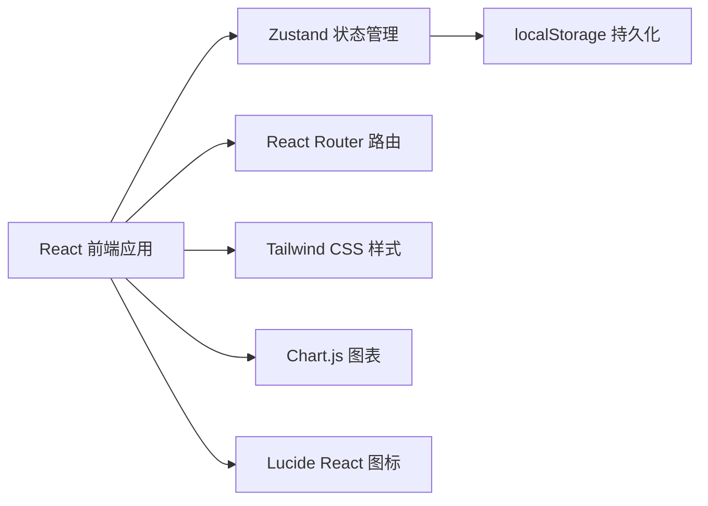
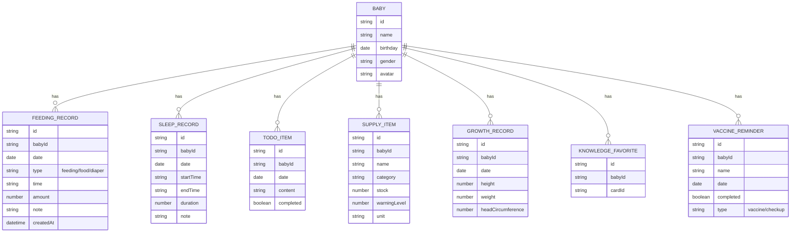

## 1. 架构设计



纯前端架构，无后端服务，所有数据存储在浏览器 localStorage 中。

## 2. 技术说明

- **前端框架**：React@18 + TypeScript
- **构建工具**：Vite
- **状态管理**：Zustand
- **样式方案**：Tailwind CSS 3
- **路由方案**：React Router DOM
- **图表库**：Chart.js + react-chartjs-2
- **图标库**：Lucide React
- **数据存储**：localStorage（纯前端）
- **初始化工具**：vite-init

## 3. 目录结构

```
src/
├── components/          # 通用组件
│   ├── Layout/         # 布局组件
│   ├── Card/           # 卡片组件
│   ├── Modal/          # 弹窗组件
│   └── Button/         # 按钮组件
├── pages/              # 页面组件
│   ├── Dashboard/      # 今日计划（首页）
│   ├── Feeding/        # 喂养记录
│   ├── Sleep/          # 睡眠记录
│   ├── Supplies/       # 用品清单
│   ├── Knowledge/      # 知识卡片
│   ├── Share/          # 家庭共享
│   └── Summary/        # 数据汇总
├── store/              # Zustand 状态
│   ├── useBabyStore.ts
│   ├── useFeedingStore.ts
│   ├── useSleepStore.ts
│   ├── useTodoStore.ts
│   ├── useSupplyStore.ts
│   ├── useGrowthStore.ts
│   └── useUISettingsStore.ts
├── utils/              # 工具函数
│   ├── date.ts
│   ├── storage.ts
│   └── export.ts
├── types/              # TypeScript 类型
│   └── index.ts
├── data/               # 静态数据
│   └── knowledgeCards.ts
├── App.tsx
├── main.tsx
└── index.css
```

## 4. 路由定义

| 路由 | 页面 | 说明 |
|------|------|------|
| / | 今日计划 | 首页，展示待办事项和快速入口 |
| /feeding | 喂养记录 | 喂奶、辅食、换尿布记录 |
| /sleep | 睡眠记录 | 睡眠时段记录和统计 |
| /supplies | 用品清单 | 库存管理和购物清单 |
| /knowledge | 知识卡片 | 月龄护理知识和收藏 |
| /share | 家庭共享 | 生成只读分享链接 |
| /summary | 数据汇总 | 成长记录、趋势图、导出 |
| /settings | 设置 | 宝宝档案管理、夜间模式 |

## 5. 数据模型

### 5.1 数据模型图



### 5.2 UI 设置存储

```typescript
interface UISettings {
  darkMode: boolean;
  currentBabyId: string | null;
  shareToken: string | null;
}
```

## 6. 状态管理设计

使用 Zustand 分模块管理状态，每个模块独立存储到 localStorage：

- **useBabyStore**：宝宝档案管理
- **useFeedingStore**：喂养记录（喂奶/辅食/尿布）
- **useSleepStore**：睡眠记录
- **useTodoStore**：今日待办
- **useSupplyStore**：用品库存
- **useGrowthStore**：成长记录
- **useUISettingsStore**：UI 设置（夜间模式、当前宝宝）

每个 store 都包含 persist 中间件，自动同步到 localStorage。
